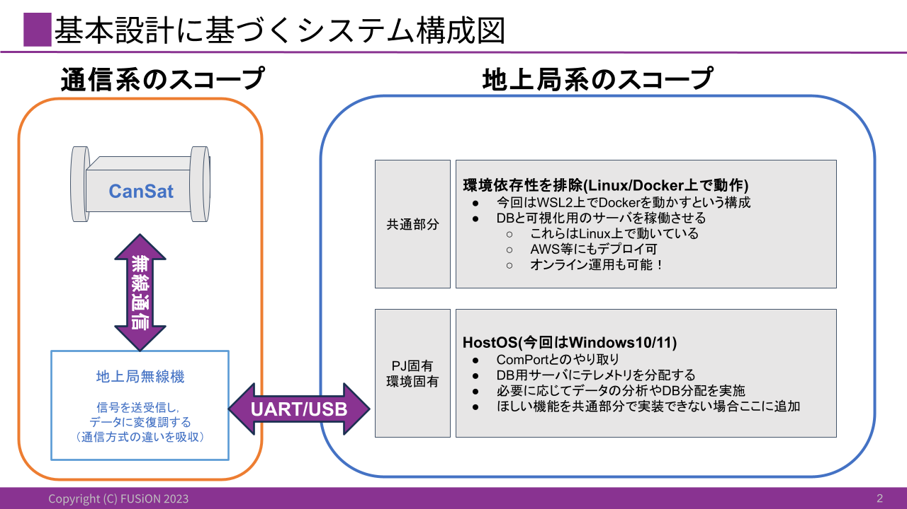

# 地上局システム 基本設計

## 地上局システムのスコープおよび他システムとのインタフェース
要件定義および要求分析に基づき,スコープおよびインタフェースを設計する

- 地上局のスコープ
    - ComPortから流れてくるJSON形式のデータを保存&可視化
        - 必要があればデータを加工
    - コマンドをComPortに対して流す
- 通信系とのインタフェース
    - 通信系のスコープ
        - `CanSat無線機-to-地上局無線機-to地上局PC`の通信
        - 無線通信部分と端末部分の仲介(データ`パース`など)
            - プロジェクト固有のコマンド&テレメトリ内容を実現
            - 通信プロトコルの差分は各無線機でのパースで吸収 
    - CanSat内部でjson形式のデータが形成され,それが任意のプロトコルで衛星局と無線局の間で通信されるものとする

## 地上局システム内部における機能の分割
要件定義および要求分析にもづき,地上局システムのスコープ内部の機能分割を設計する

- `前提`
    - Windowsで利用すること
        - 開発者PCのOSがWindows10,11であることやメンバーの多くがWindowsOSユーザーであることから以上のような前提を設けることとする
    - ローカルシステムに必ずデータが保存できること 
        - 制御履歴等を大会運営側に提出する必要がある 
- `テレメトリ可視化機能およびデータベース`
    - AWSへのデプロイ等を考慮し，Linux環境で動かしたい
    - WSL2上でDockerを動かし,その上でDBおよび可視化機能を実装する
        - DBサーバを用意してデータを保存&可視化機能の参照元に
- `ComPortインタフェース`
    - ホストOS上にソースを用意して実行する
    - 受信したデータをCSVに保存する
    - コマンドの送信およびテレメトリの受信を行う
        - 受信したテレメトリはDBに送信する
    - ターミナル画面の設計
        - 起動時には接続するComPort番号やボーレートの入力を求める
        - コマンド送信の待機および送信ログを表示する
        - エラー時にはエラーメッセージを表示する
        - Ctrl + Cで終了する

## システム構成図
基本設計に戻づくシステム構成図を示す
