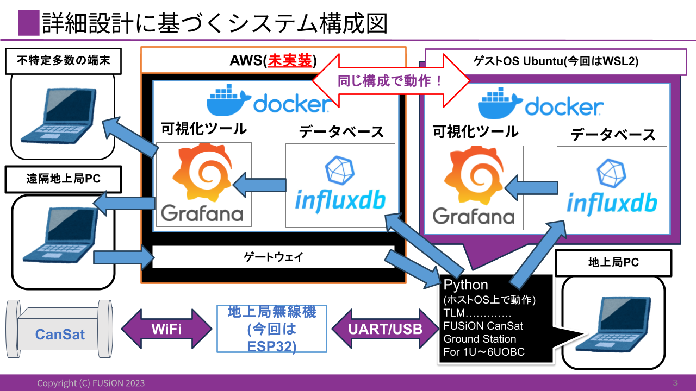
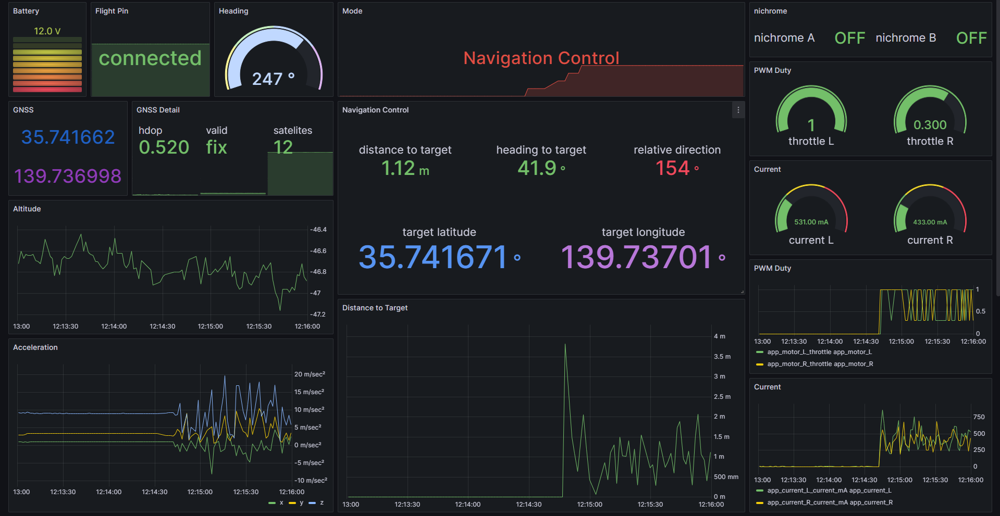

# 地上局システム 詳細設計

## 技術選定
- `テレメトリ可視化機能およびデータベース`
    - `SLIM`のテレメトリの可視化を参考に決定
        - 可視化ソフト`Grafana` + 時系列DB`InfluxDB`
- `ComPortインタフェース`
    - 多くの学部生が触れる機会を考慮して選定
        - `Python`

## システム構成図
詳細設計に基づくシステム構成図を示す。

## Grafanaによるデータの可視化
実際のCanSatテレメトリの可視化例を示す。

